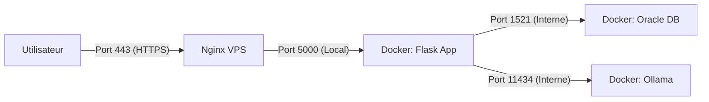

# Déploiement Docker pour SQL-IA

Ce projet est conteneurisé avec Docker Compose. Il déploie :
- L'application Flask (port 5000 sur localhost).
- La base de données Oracle Free.
- Le serveur d'IA Ollama.

## Prérequis

- [Docker](https://docs.docker.com/get-docker/) & Docker Compose.
- [Nginx](https://www.nginx.com/) installé sur le serveur hôte.
- [Ollama](https://ollama.com/) (optionnel sur l'hôte, car inclus dans Docker, mais utile pour tester).

## Architecture



## Installation

### 1. Configuration Nginx (Reverse Proxy)

Copiez `nginx_vps.conf` dans `/etc/nginx/sites-available/sqlia.conf` et activez-le.

### 2. Démarrage des conteneurs

```bash
docker-compose up -d --build
```

### 3. Initialisation du modèle IA

Au premier lancement, le conteneur Ollama est vide. Il faut télécharger le modèle utilisé (`sqlcoder:7b` par défaut).

```bash
docker exec -it sqlia-ollama ollama run sqlcoder:7b
```
*Cette commande va télécharger le modèle (plusieurs Go) et lancer un prompt. Une fois le prompt `>>>` affiché, vous pouvez faire Ctrl+D pour quitter.*

## Vérification

Rendez-vous sur `https://votre_domaine.com`.
L'application doit fonctionner, se connecter à Oracle et générer du SQL via Ollama.

## Commandes Utiles

- Logs application : `docker-compose logs -f sqlia-app`
- Logs Ollama : `docker-compose logs -f ollama`
- Arrêt : `docker-compose down`
